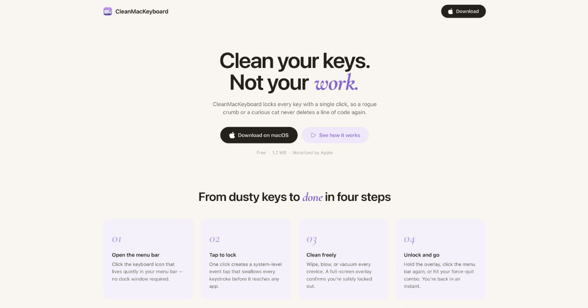

<p align="center">
  
</p>

<h1 align="center">CleanMacKeyboard</h1>

<p align="center">
  <strong>Lock your keyboard, clean with confidence.</strong><br>
  A tiny macOS menu-bar utility that locks every key with a single click.
</p>

<p align="center">
  <a href="https://github.com/dqev/cleanmackeyboard/releases/download/v1.0.0/CleanMacKeyboard.dmg">Download DMG</a> ·
  <a href="https://github.com/dqev/cleanmackeyboard">Source Code</a> ·
  <a href="https://cleanmackeyboard.vercel.app">Website</a>
</p>

---

## Why

Cleaning a keyboard while the computer is on is risky — one accidental keystroke can delete code, send an unfinished message, or trigger something worse. CleanMacKeyboard blocks all key events (including modifiers) with a single click and restores them just as easily.

## How It Works

The app creates a system-level **CGEventTap** that intercepts every keyboard event (`keyDown`, `keyUp`, `flagsChanged`) before any other process receives it. While locked, only whitelisted keys (media keys, brightness controls) pass through. A configurable **force-quit combo** instantly unlocks the keyboard even if the app is frozen.

Blocked events are counted and displayed so you know exactly what was prevented.

## Features

- **One-click lock/unlock** from the menu bar
- **Full keyboard blocking** — modifiers, alphanumeric, function keys — everything is captured
- **Force-quit combo** — a customisable shortcut (default ⌘⇧Q) that unlocks instantly
- **Whitelisted media keys** — volume, brightness, play/pass through while locked
- **Blocked-events counter** — see how many keystrokes were prevented
- **Auto-unlock on sleep** — optionally unlock when the Mac sleeps
- **Lock overlay** — full-screen overlay on all displays while locked
- **Hold-to-unlock** — requires a deliberate press to prevent accidental unlock
- **Session timer** — tracks how long the keyboard has been locked
- **Launch at login** — starts automatically in the menu bar

## Requirements

- macOS **14.0** or later
- **Accessibility permission** (required by CGEventTap)

## Installation

1. Download the latest DMG from the [releases page](https://github.com/dqev/cleanmackeyboard/releases)
2. Drag **CleanMacKeyboard.app** to **Applications**
3. Right-click → **Open** (first launch only — Gatekeeper warning)
4. Grant **Accessibility** permission when prompted

## Security & Permissions

CleanMacKeyboard uses `CGEvent.tapCreate` which requires the **Accessibility** permission — the same API used by Karabiner-Elements, BetterTouchTool, and macOS Shortcuts.

The app does **not** require:
- Full Disk Access
- Screen Recording
- Input Monitoring
- Network access (the app is fully offline)

## Building from Source

```bash
git clone https://github.com/dqev/cleanmackeyboard.git
cd CleanMacKeyboard
xcodebuild -project CleanMacKeyboard.xcodeproj -scheme CleanMacKeyboard -configuration Release build
```

## Architecture

```
CleanMacKeyboard.app/
├── CleanMacKeyboardApp.swift       # App entry, window management
├── Core/
│   ├── KeyboardLocker.swift        # Event tap, lock/unlock, thread-safe state
│   └── KeyCombo.swift              # Key code + modifier matching
├── Models/
│   └── AppSettings.swift           # UserDefaults-backed settings
└── UI/
    ├── ContentView.swift           # Main app window
    ├── SettingsView.swift          # Menu-bar popover content
    ├── MenuBarController.swift     # NSStatusItem, popover, lock overlays
    ├── LockOverlayView.swift       # Full-screen lock overlay with hold gesture
    ├── OnboardingView.swift        # First-launch accessibility guide
    ├── WhitelistKeyPicker.swift    # Media key selection grid
    └── DesignSystem.swift          # Colors, spacing, typography
```

## License

MIT
